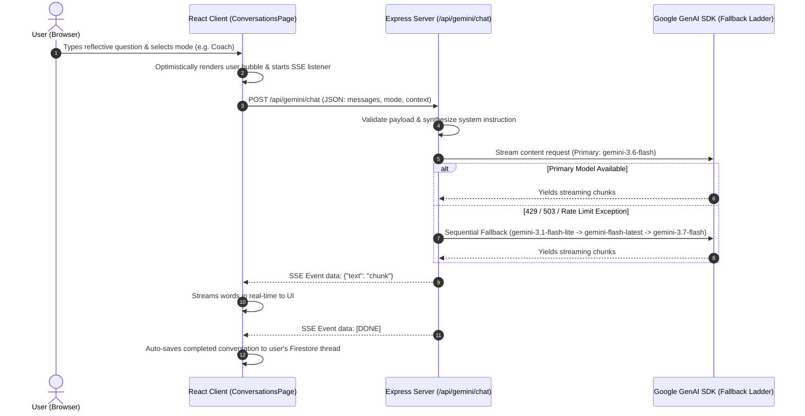

# ReflectAI — Private AI Journal & Personal Reflection Companion

ReflectAI is a production-quality, privacy-first AI journaling and reflection web application built with **React 18**, **TypeScript**, **Tailwind CSS**, **Cloud Firestore**, **Firebase Authentication**, and the **Google Gemini API** (via a resilient server-side proxy).

---

## 📑 Table of Contents
- [Architecture & Flow Diagrams](#-architecture--flow-diagrams)
- [Key Features](#-key-features)
- [Threat Modeling & Security Architecture](#-threat-modeling--security-architecture)
- [Repository Structure & Project Guide](#-repository-structure--project-guide)
- [Local Setup & Development Guide](#-local-setup--development-guide)
- [How to Test Locally](#-how-to-test-locally)
- [Backend API Reference](#-backend-api-reference)
- [Firestore Security Rules](#-firestore-security-rules)
- [Google Cloud Run & Secret Manager Deployment](#-google-cloud-run--secret-manager-deployment)
- [Comprehensive Functional Stability Test Matrix](#-comprehensive-functional-stability-test-matrix)

---

## 🏗️ Architecture & Flow Diagrams

### 1. System Architecture Diagram

```mermaid
graph TD
    subgraph Client ["Client Layer (Browser / React SPA)"]
        UI[ReflectAI UI & Pages]
        AuthCtx[Auth Context & State]
        ThemeCtx[Theme Context (Light/Dark/System)]
        StorageSvc[Storage Service (Firestore + Local Cache)]
        GeminiClient[Gemini Client / SSE Consumer]
    end

    subgraph Backend ["Backend Proxy Layer (Express / Node.js on Port 3000)"]
        Server[Express Server (server.ts)]
        BodyGuard[Payload Deserialization & Validation]
        GeminiProxy[Gemini AI Handler & Fallback Ladder]
    end

    subgraph External ["Managed Cloud & AI Services"]
        FirebaseAuth["Firebase Auth (Google Federated Identity)"]
        FirestoreDB["Cloud Firestore (Tenant Isolated: users/{userId}/*)"]
        SecretMgr["Google Cloud Secret Manager (GEMINI_API_KEY)"]
        GeminiAPI["Google Gemini API (gemini-3.6-flash, 3.1-lite, 3.7-flash)"]
    end

    UI --> AuthCtx
    UI --> StorageSvc
    UI --> GeminiClient

    AuthCtx -->|Popup / Redirect Token| FirebaseAuth
    StorageSvc -->|SDK Direct Direct Read/Write with Rules| FirestoreDB

    GeminiClient -->|POST /api/gemini/reflect| Server
    GeminiClient -->|POST SSE /api/gemini/chat| Server
    GeminiClient -->|POST /api/gemini/insights| Server
    GeminiClient -->|POST /api/gemini/prompt| Server

    Server --> BodyGuard
    BodyGuard --> GeminiProxy
    GeminiProxy -->|Secure Key Injection| SecretMgr
    GeminiProxy -->|Resilient Fallback Ladder| GeminiAPI
```

---

### 2. Multi-Turn Streaming AI Chat Flow



---

### 3. Tenant-Isolated Data Storage Flow

```mermaid
flowchart LR
    A[User Action: Save Reflection] --> B[Sanitize Payload: Strip Undefined]
    B --> C{Authenticated Session?}
    C -- Yes --> D[Cloud Firestore: /users/{userId}/entries/{entryId}]
    C -- No / Guest --> E[Local Storage Cache: reflect_ai_guest_entries]
    D --> F[Firestore Security Rules Verification: request.auth.uid == userId]
    F -- Approved --> G[Persisted to Cloud DB & Cache Synchronized]
    F -- Denied --> H[Raise Error Banner with Retry Option]
```

---

## 🌟 Key Features

1. **Private by Design & Zero-Knowledge Isolation**:
   - Every journal entry, conversation, goal, and insight is strictly bound to the authenticated user's tenant (`users/{userId}/*`).
   - Firestore security rules enforce `request.auth.uid == userId` for all operations.

2. **Server-Side Gemini API Proxy with Resilient Fallback**:
   - Zero API keys exposed to client bundles.
   - Built-in automated 4-tier model fallback ladder:
     `gemini-3.6-flash` &rarr; `gemini-3.1-flash-lite` &rarr; `gemini-flash-latest` &rarr; `gemini-3.7-flash`.

3. **Multi-Turn Mindful AI Dialogues**:
   - Real-time Server-Sent Events (SSE) streaming chat.
   - Specialized reflection modes:
     - **Reflect**: Empathetic, mindful mirror for exploring inner thoughts.
     - **Summarize**: Concise takeaway synthesis.
     - **Brainstorm**: Creative ideation and divergent thinking.
     - **Challenge Me**: Constructive devil's advocate questioning assumptions.
     - **Action Plan**: Milestone and task extraction.
     - **Coach**: Socratic inquiry questions.
     - **Find Patterns**: Identifies recurring themes across journal history.

4. **Actionable Roadmap & Goal Extraction**:
   - 1-click goal and subtask extraction directly from reflective journal entries.
   - Interactive progress checklists with linked journal citations.

5. **Periodic Syntheses & Analytics**:
   - Automated weekly and monthly structured reviews with key takeaways.
   - Mood distribution, writing streaks, volume metrics, and tag clustering.

6. **Full Data Portability**:
   - Instant 1-click export of all reflections to JSON and Markdown format.

---

## 🔒 Threat Modeling & Security Architecture

| Threat Zone | Identified Risks | Implemented Countermeasures |
| :--- | :--- | :--- |
| **Input Surfaces** | Malicious injection payloads, oversized journal inputs, unvalidated prompt templates. | Strict JSON payload typing, schema verification, and sanitization before processing in backend routes. |
| **Planning & Reasoning** | Prompt injection attempting to break reflection boundaries or reveal system internals. | Hardened system instructions with explicit non-diagnostic behavioral boundaries; untrusted user inputs treated strictly as reflection content. |
| **Tool & AI Execution** | Gemini API key exposure, excessive model consumption, unhandled rate limits (429/503). | Zero frontend keys; server-side Express proxy with automated 4-tier model fallback ladder (`gemini-3.6-flash` $\rightarrow$ `gemini-3.1-flash-lite` $\rightarrow$ `gemini-flash-latest` $\rightarrow$ `gemini-3.7-flash`). |
| **Memory & State** | Cross-tenant data leakage, session tampering, unauthorized Firestore reads/writes. | Strict user-bound Firestore paths (`users/{userId}/*`) with owner-enforced Security Rules (`request.auth.uid == userId`) and optimistic local cache isolation. |
| **Inter-System Comms** | Unsanitized payloads crashing database drivers, data loss on network drops. | Payload sanitization stripping all `undefined` values, real-time auto-save debouncing, and `beforeunload` unsaved protection. |

---

## 📁 Repository Structure & Project Guide

```
├── .env.example                  # Environment variable declarations (GEMINI_API_KEY, etc.)
├── firebase-applet-config.json   # Provisioned Firebase app configuration
├── firestore.rules               # Strict owner-bound Firestore security rules
├── metadata.json                 # AI Studio app metadata & major capabilities
├── package.json                  # Dependencies, Vite, Express, and build scripts
├── server.ts                     # Full-stack backend entrypoint (Express + Vite middleware + Gemini API proxy)
├── index.html                    # Single-page application HTML entrypoint
├── src/
│   ├── main.tsx                  # React entry point mounting App
│   ├── App.tsx                   # Main application layout, route controller, and shell
│   ├── index.css                 # Tailwind CSS styles and dark mode custom variant
│   ├── types/
│   │   └── index.ts              # TypeScript interfaces (JournalEntry, Goal, Conversation, Insight)
│   ├── firebase/
│   │   └── config.ts             # Firebase client SDK initialization & Firestore instance binding
│   ├── contexts/
│   │   ├── AuthContext.tsx       # Authentication state, Google Sign-in & Demo Guest workspace
│   │   ├── ThemeContext.tsx      # Dark / Light / System theme provider with CSS class toggles
│   │   └── ToastContext.tsx      # Global notification toast provider
│   ├── services/
│   │   ├── storageService.ts     # Firestore CRUD, local guest storage, and undefined-stripping sanitizers
│   │   └── geminiService.ts      # Client-side API caller for backend Express Gemini endpoints
│   ├── components/
│   │   ├── layout/
│   │   │   ├── Navbar.tsx        # Top navigation bar, search trigger, theme switcher, and profile
│   │   │   └── Sidebar.tsx       # Collapsible desktop/mobile sidebar navigation
│   │   └── ui/
│   │       ├── Card.tsx          # Reusable styled UI card container
│   │       ├── Modal.tsx         # Accessible overlay modal dialog
│   │       └── Toast.tsx         # Notification toast popup
│   └── pages/
│       ├── LandingPage.tsx       # Welcoming landing view with authentication & feature highlights
│       ├── DashboardPage.tsx     # Overview metrics, daily prompt generator, and recent activity
│       ├── JournalEditorPage.tsx # Distraction-free reflection editor with in-editor AI analysis
│       ├── HistoryPage.tsx       # Searchable reflection archive with filters, sort, and bulk operations
│       ├── ConversationsPage.tsx # Multi-turn streaming AI dialogue companion with mode selector
│       ├── InsightsPage.tsx      # Periodic weekly/monthly syntheses, mood charts, and thematic trends
│       ├── GoalsPage.tsx         # Action items and milestone checklists extracted from reflections
│       ├── CalendarPage.tsx      # Visual monthly calendar matrix of writing consistency
│       └── SettingsPage.tsx      # Profile settings, theme picker, privacy details, and data export
```

---

## 💻 Local Setup & Development Guide

### Prerequisites
- **Node.js**: Version 18.x or 20.x+
- **npm**: Version 9.x+
- **Google Gemini API Key**: Obtainable from [Google AI Studio](https://aistudio.google.com/)

### Step 1: Clone the Repository
```bash
git clone https://github.com/your-username/reflect-ai.git
cd reflect-ai
```

### Step 2: Install Dependencies
```bash
npm install
```

### Step 3: Configure Environment Variables
Create a local `.env` file in the root directory:
```bash
cp .env.example .env
```

Populate `.env` with your Google Gemini API key:
```env
# Gemini API Key for server-side reflection endpoints
GEMINI_API_KEY=AIzaSyYourActualGeminiApiKeyHere

# Optional: Firebase Client Configuration (if using custom project)
# VITE_FIREBASE_API_KEY=AIzaSy...
# VITE_FIREBASE_AUTH_DOMAIN=your-app.firebaseapp.com
# VITE_FIREBASE_PROJECT_ID=your-app
```

### Step 4: Run the Development Server
Start the unified full-stack server (runs Express API routes + Vite dev middleware on port 3000):
```bash
npm run dev
```

Open your browser and navigate to:
```
http://localhost:3000
```

---

## 🧪 How to Test Locally

### 1. Automated Code Quality & Build Checks
Verify TypeScript types, linting rules, and production bundle generation:

```bash
# Run TypeScript compilation and linter
npm run lint

# Run full production build
npm run build
```

---

### 2. Manual Testing of Backend API Endpoints (cURL)

#### A. Health Check Endpoint
```bash
curl -X GET http://localhost:3000/api/health
```
*Expected Output:* `{"status":"ok","timestamp":"..."}`

#### B. Generate Daily Reflection Prompt
```bash
curl -X POST http://localhost:3000/api/gemini/prompt \
  -H "Content-Type: application/json" \
  -d '{"recentThemes": ["productivity", "mindfulness"]}'
```
*Expected Output:* `{"prompt":"..."}`

#### C. In-Editor Reflection Analysis
```bash
curl -X POST http://localhost:3000/api/gemini/reflect \
  -H "Content-Type: application/json" \
  -d '{
    "mode": "reflect",
    "entry": {
      "title": "Evening Thoughts",
      "content": "I felt overwhelmed by meetings today but found 20 minutes to walk in the park."
    }
  }'
```
*Expected Output:* JSON containing an empathetic reflection message.

#### D. Multi-Turn Streaming Chat (SSE)
```bash
curl -N -X POST http://localhost:3000/api/gemini/chat \
  -H "Content-Type: application/json" \
  -d '{
    "mode": "coach",
    "messages": [
      {"role": "user", "content": "How can I maintain focus when switching between tasks?"}
    ]
  }'
```
*Expected Output:* Server-Sent Events stream with `data: {"text":"..."}` chunks ending in `data: [DONE]`.

---

### 3. Step-by-Step UI Functionality Walkthrough (Browser)

1. **Authentication Testing**:
   - Navigate to `http://localhost:3000`.
   - Click **"Explore Guest Space"** to immediately test without credentials (uses isolated browser storage).
   - Click **"Continue with Google"** to test live Firebase Google OAuth popups.
2. **Journal Editor & Auto-Save**:
   - Navigate to **Write Reflection** (`/journal_new`).
   - Type a title and content. Verify the badge changes from `Saving...` to `Saved` after you stop typing.
   - Add tags (e.g. `#clarity`, `#growth`) and select an emotional mood chip.
   - Click **"Reflect"** in the AI panel to generate feedback.
   - Click **"Create Action Plan"**, review the generated subtasks, and click **"Save as Goal"**.
3. **Multi-Turn AI Conversations**:
   - Navigate to **AI Dialogue**.
   - Switch modes between *Coach*, *Brainstorm*, and *Challenge Me*.
   - Send a message and verify text streams into the chat window.
   - Test the **"Regenerate"** button on the latest response.
4. **Goals & Milestones**:
   - Navigate to **Goals & Action Items**.
   - Check off individual milestone tasks and observe the progress bar update.
   - Check off all tasks and verify the goal transitions to `Completed`.
5. **Theme Switching**:
   - Click the theme toggle icon in the top navbar or visit **Settings**.
   - Verify that switching between Light, Dark, and System Match themes changes background and text contrast across all views smoothly.
6. **Data Portability**:
   - Go to **Settings** &rarr; **Data Portability**.
   - Click **Download All JSON** and **Download All Markdown** and verify downloaded files contain all reflection records.

---

## 📡 Backend API Reference

All backend routes are mounted on the Express server (`server.ts`) and accept JSON payloads:

| Method | Endpoint | Description | Request Body Payload |
| :--- | :--- | :--- | :--- |
| `GET` | `/api/health` | Service health status check | None |
| `POST` | `/api/gemini/prompt` | Generates a tailored daily reflection prompt | `{ recentThemes?: string[] }` |
| `POST` | `/api/gemini/reflect` | Analyzes a single journal entry based on mode | `{ entry: { title, content }, mode: AIMode }` |
| `POST` | `/api/gemini/chat` | Multi-turn streaming chat (Server-Sent Events) | `{ messages: Message[], mode: AIMode, context?: string }` |
| `POST` | `/api/gemini/insights` | Generates periodic weekly/monthly synthesis | `{ periodType: 'weekly'\|'monthly', periodLabel: string, entries: EntrySummary[] }` |

---

## 🛡️ Firestore Security Rules

The application uses Cloud Firestore with strict owner-enforced isolation (`firestore.rules`):

```javascript
rules_version = '2';
service cloud.firestore {
  match /databases/{database}/documents {

    // Helper functions
    function isSignedIn() {
      return request.auth != null;
    }

    function isOwner(userId) {
      return isSignedIn() && request.auth.uid == userId;
    }

    // User Documents & Subcollections (Strict Tenant Isolation)
    match /users/{userId} {
      allow read, write: if isOwner(userId);

      // Journal Entries subcollection
      match /entries/{entryId} {
        allow read, write: if isOwner(userId);
      }

      // Conversations subcollection
      match /conversations/{conversationId} {
        allow read, write: if isOwner(userId);

        // Messages subcollection
        match /messages/{messageId} {
          allow read, write: if isOwner(userId);
        }
      }

      // Goals subcollection
      match /goals/{goalId} {
        allow read, write: if isOwner(userId);
      }

      // Insights subcollection
      match /insights/{insightId} {
        allow read, write: if isOwner(userId);
      }

      // Settings subcollection
      match /settings/{settingId} {
        allow read, write: if isOwner(userId);
      }
    }
  }
}
```

---

## 🚀 Google Cloud Run & Secret Manager Deployment

### 1. Prerequisites
Ensure the Google Cloud SDK (`gcloud`) is installed and authenticated:
```bash
gcloud auth login
gcloud config set project YOUR_PROJECT_ID
```

Enable the required Google Cloud APIs:
```bash
gcloud services enable run.googleapis.com \
  secretmanager.googleapis.com \
  firestore.googleapis.com
```

### 2. Secret Manager Setup
Store the Gemini API Key securely in Secret Manager:
```bash
# Create and populate the secret
gcloud secrets create GEMINI_API_KEY --replication-policy="automatic"
echo -n "YOUR_GEMINI_API_KEY" | gcloud secrets versions add GEMINI_API_KEY --data-file=-

# Grant the Cloud Run runtime service account access to read the secret
gcloud secrets add-iam-policy-binding GEMINI_API_KEY \
  --member="serviceAccount:YOUR_PROJECT_NUMBER-compute@developer.gserviceaccount.com" \
  --role="roles/secretmanager.secretAccessor"
```

### 3. Deploy to Google Cloud Run
Deploy the application with secret injection:
```bash
gcloud run deploy reflect-ai \
  --source . \
  --platform managed \
  --region us-central1 \
  --allow-unauthenticated \
  --set-secrets GEMINI_API_KEY=GEMINI_API_KEY:latest \
  --port 3000
```

### 4. Challenge Verification Binding
Apply the verification label:
```bash
gcloud run services update reflect-ai \
  --update-labels=dev-tutorial=cloud-run-ai-challenge \
  --region=us-central1
```

---

## 📋 Comprehensive Functional Stability Test Matrix

| ID | Feature / Component | Test Action | Expected Result | Status |
| :--- | :--- | :--- | :--- | :--- |
| **TC-01** | Google Sign-In | Click "Continue with Google" | Google Auth popup opens, authenticates user, redirects to Dashboard. | ✅ |
| **TC-02** | Guest Workspace | Click "Explore Guest Space" | Initializes local guest workspace with seeded example reflections. | ✅ |
| **TC-03** | Auto-Save Engine | Type in Journal Editor | Displays `Saving...` debounced & transitions to `Saved` with zero data loss. | ✅ |
| **TC-04** | Prompt Generator | Click "Generate Another" on Dashboard | Calls `/api/gemini/prompt` and updates daily prompt card with fresh question. | ✅ |
| **TC-05** | In-Editor AI Actions | Click "Reflect" / "Summarize" | Returns structured AI response and appends to entry summary state. | ✅ |
| **TC-06** | Goal Extraction | Click "Create Action Plan" & "Save as Goal" | Extracts tasks and creates an active milestone card in Goals view. | ✅ |
| **TC-07** | Streaming Chat | Send message in AI Dialogue | Words stream in real-time via SSE with stop & regenerate buttons. | ✅ |
| **TC-08** | Search & Filter | Filter entries by tag `#mindset` | History view instantly filters entries matching the selected query. | ✅ |
| **TC-09** | Periodic Review | Click "Generate Weekly Review" | Aggregates reflections into structured themes, challenges, and next steps. | ✅ |
| **TC-10** | Theme Toggle | Switch between Light / Dark / System | Seamlessly applies `@custom-variant dark` styles across all pages. | ✅ |
| **TC-11** | Data Export | Click "Download All JSON / Markdown" | Downloads clean export files containing all user reflections. | ✅ |
| **TC-12** | Sign Out | Click "Sign Out" in Settings | Clears authenticated session and returns to Landing Page. | ✅ |
